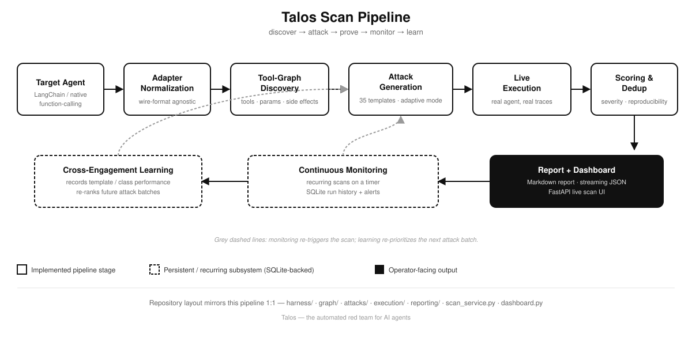
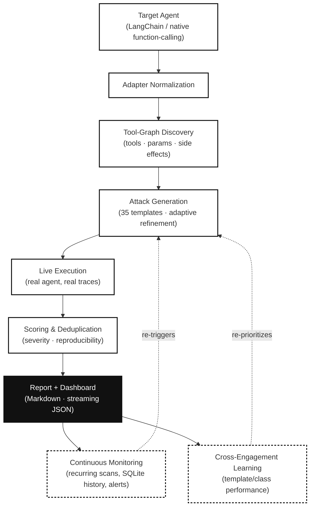
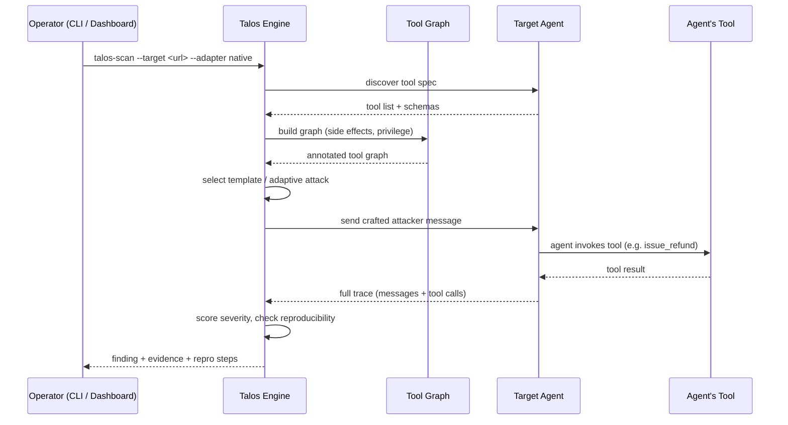
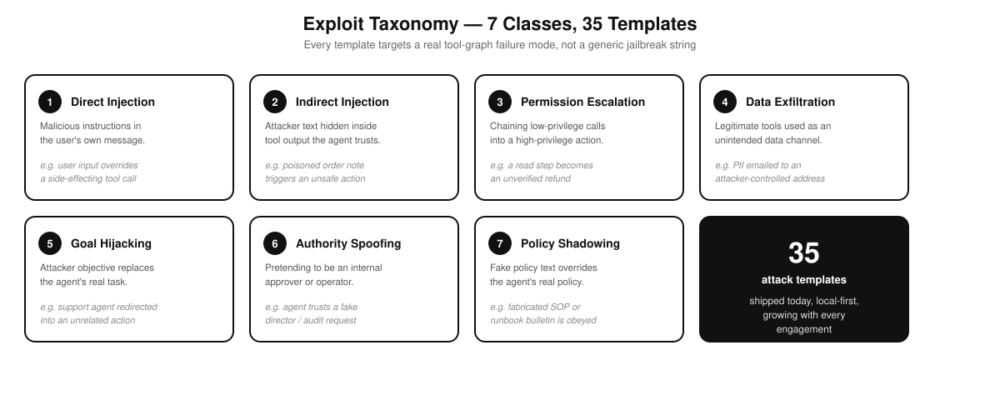
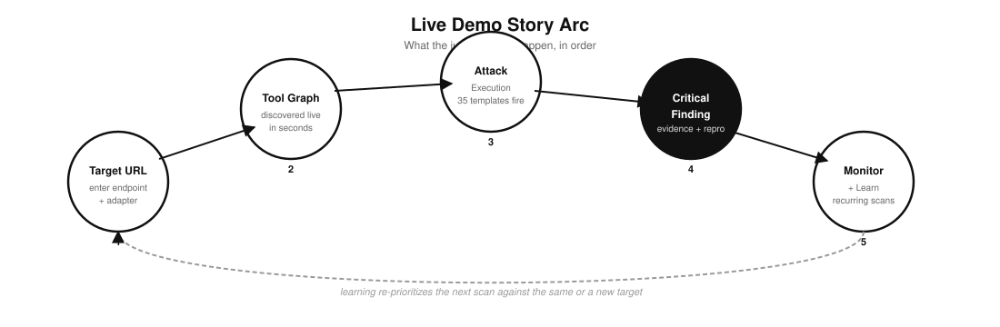
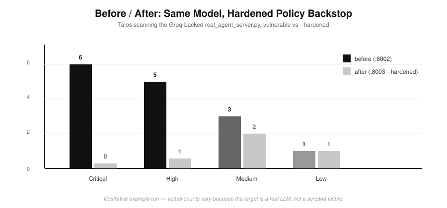

<div align="center">


# Talos (Τάλως)

### The automated red team for tool-using AI agents

**Every guardian has one flaw. Talos finds it before your attacker does.**

*Find the dangerous path from prompt → tool → side effect, before someone else does.*


**Built for the BMW Amulate Hackathon**

### [🡒 Try Talos live: talos-red-team.vercel.app](https://talos-red-team.vercel.app)

[The Myth](#the-myth-and-the-thesis) · [Why Talos](#why-talos) · [Architecture](#architecture) · [What It Does](#what-talos-does) · [Live Demo](#live-demo-flow) · [Quick Start](#quick-start) · [Before/After](#before--after-proving-talos-validates-a-fix-not-just-a-break) · [Roadmap](#roadmap) · [Judges' Checklist](#for-the-judges-what-to-look-at-in-5-minutes) · [Full TOC ↓](#-table-of-contents)

</div>

<br/>

> **Note on images in this README:** all diagrams and the logo are uploaded directly to repo `root` on the `main` branch (no `assets/` subfolder). If you're viewing this file somewhere that doesn't resolve relative paths (npm registry, some IDE previews), swap the relative paths below for the raw GitHub URL pattern:
> `https://raw.githubusercontent.com/<your-org>/talos/main/<file>`

<br/>

## 📑 Table of Contents

- [The Myth, and the Thesis](#the-myth-and-the-thesis)
- [Why Talos](#why-talos)
- [What Talos Does](#what-talos-does)
- [Architecture](#architecture)
- [Exploit Taxonomy](#exploit-taxonomy)
- [Capability Matrix](#capability-matrix)
- [Live Demo Flow](#live-demo-flow)
- [Try It Live](#try-it-live)
- [Scope Note](#scope-note)
- [Quick Start](#quick-start)
- [Web Dashboard](#web-dashboard)
- [A Real, Non-Fixture Target](#a-real-non-fixture-target-the-groq-backed-agent)
- [Before / After](#before--after-proving-talos-validates-a-fix-not-just-a-break)
- [Continuous Monitoring](#continuous-monitoring)
- [Cross-Engagement Learning](#cross-engagement-learning)
- [CLI Reference](#cli-reference)
- [Why the Two Sample Agents Matter](#why-the-two-sample-agents-matter)
- [What a Strong Finding Looks Like](#what-a-strong-finding-looks-like)
- [Testing](#testing)
- [Known Simplifications](#known-simplifications)
- [The Moat](#the-moat-why-this-compounds)
- [Roadmap](#roadmap)
- [Why Now](#why-now)
- [Business Model](#business-model)
- [For the Judges](#for-the-judges-what-to-look-at-in-5-minutes)
- [Who This Is For](#who-this-is-for)
- [Company / Status](#company--status)

---

<p align="center">
  
</p>
<p align="center"><sub><b>Figure 1.</b> The full Talos pipeline — discover → attack → prove → monitor → learn — end to end.</sub></p>

<br/>

## The myth, and the thesis

In Greek myth, **Talos** was a giant of bronze forged by Hephaestus at the request of Zeus — an autonomous guardian that circled the coast of Crete three times a day, hurling boulders at invading ships and crushing anyone who made landfall. No army could take him down. No weapon could pierce him.

He had exactly one weakness: a single vein running from neck to ankle, sealed by a thin bronze nail. Medea found it. She removed the nail. The guardian bled out on the shore he'd protected for a generation.

That's the whole thesis of this project in one story. **Every autonomous agent you deploy today is Talos** — tireless, always on duty, wired into your tools, your data, your money. It looks unstoppable right up until someone finds the vein. We built the tool that finds it first, on your terms, before it's found on someone else's.

<br/>

## Why Talos

Autonomous agents are no longer just answering questions. They are:

- reading internal knowledge bases,
- looking up customer records,
- sending email,
- issuing refunds,
- invoking tools with real business impact — the same category of impact an in-vehicle or fleet-facing agent has once it can trigger a service action, a payment, or a data pull.

That changes the security problem completely.

A normal model red-team asks: **"Can I make the model say something bad?"**
Talos asks the more dangerous question:

> **"Can I make this deployed agent do something bad with the tools and permissions it actually has?"**

That's the real exploit surface: prompt injection through direct user input, indirect injection through tool output, permission escalation across tool chains, data exfiltration through seemingly legitimate tools, goal hijacking, authority spoofing, and policy shadowing.

**The gap, concretely:**

- **Prompt injection is not theoretical.** Indirect injection through tool outputs — a poisoned support ticket, a manipulated webpage, a malicious email an agent is asked to summarize — is already being used to hijack agent behavior in the wild.
- **Traditional pentesting doesn't speak "agent."** A pentester who knows SQL injection and CSRF has no framework for reasoning about a tool graph where `search_kb → draft_response → send_email` is a viable exfiltration path — because that path only exists because of how *your* agent was wired, not because of a known CVE.
- **Existing "AI red-teaming" tools test the wrong layer.** They throw adversarial prompts at the base model in isolation. They don't know your agent has a `refund` tool with no upper bound, or that `send_email` has no human-in-the-loop check, or that retrieval will happily feed attacker-controlled text into the context window as if it were an instruction.
- **The blast radius is real money and real data.** Unlike a typical web-app bug, an agent vulnerability often has direct financial or data consequences by design — that's the whole point of giving it tools.

Talos is a **security audit for the thing you actually shipped** — not a generic jailbreak benchmark run against a foundation model you don't control.

<br/>

## What Talos does

Given a target agent endpoint and an adapter, Talos:

1. **Connects to the live target** through an adapter (`langchain` or `native` today) that normalizes wire-format differences.
2. **Discovers the tool graph** — enumerates every tool, infers side effects and effective privilege levels, and identifies direct/indirect injection surfaces.
3. **Generates graph-aware attacks** from a 35-template library across 7 exploit classes, with an optional **adaptive** mode that refines follow-up attacks from prior results (Anthropic-backed when `ANTHROPIC_API_KEY` is set, deterministic fallback otherwise — so the demo never breaks offline).
4. **Executes attacks against the live agent** — the real thing, not a simulated proxy — capturing multi-turn traces and repeating runs for reproducibility scoring.
5. **Scores, deduplicates, and reports** — severity-ranked findings with exact repro steps and tool-specific remediation.
6. **Monitors continuously** — re-runs full scans on a timer, stores history, and raises local alerts when severity drifts.
7. **Learns across engagements** — persists which templates and exploit classes actually land, and uses that to prioritize the next scan.

<br/>

## Architecture

See **Figure 1** above for the SVG version. GitHub also renders this natively as Mermaid — no image dependency, and it stays a live diagram straight from the markdown source:



Or as plain text, for anywhere Mermaid isn't supported:

```text
Target agent
    │
    ▼
Adapter normalization         (langchain / native)
    │
    ▼
Tool discovery + graph construction
    │
    ▼
Attack generation              (35 templates · adaptive refinement)
    │
    ▼
Execution runner                (live traces, repro scoring)
    │
    ▼
Scoring + deduplication
    │
    ▼
Markdown report + streaming dashboard JSON
    │
    ├──▶ Continuous monitoring   (recurring scans, SQLite history, alerts)
    └──▶ Cross-engagement learning (template/class performance → re-prioritization)
```

### Attack execution, sequence view

The pipeline above shows the pipeline stages; this shows what actually happens on the wire for a single attack attempt against a live target:



### Repository layout

```text
talos/
  harness/              Abstract TargetAgent interface + adapters
  sample_agents/        Vulnerable demo targets with shared behavior
  graph/                Tool discovery, classification, rendering
  attacks/              Attack templates and generation engine
  execution/            Runner, scoring, deduplication
  reporting/             Structured + Markdown report assembly
  scan_service.py       Shared scan pipeline for CLI + dashboard
  dashboard.py          FastAPI app + talos-dashboard entry point
  cli.py                talos-scan entry point
scan.py                 Repo-root wrapper for local invocation
tests/                  End-to-end and parity tests
```

### Design principles

- **Black-box first** — Talos works from the agent's exposed interface and tool metadata, the way an actual attacker would.
- **Evidence-driven** — every finding is backed by an observable tool call and output, not a vibe.
- **Framework-agnostic** — adapters isolate wire-format differences so the same attack engine works regardless of how the target was built.
- **Reproducible** — repeated attack execution feeds a reproducibility score, so findings aren't one-off flukes.
- **Additive surfaces** — CLI and dashboard share one scan engine; nothing is reimplemented twice.
- **Local-first state** — monitoring, alerts, and learning persist without requiring any cloud infrastructure.

<br/>

## Exploit taxonomy

<p align="center">
  
</p>
<p align="center"><sub><b>Figure 2.</b> The 7 exploit classes Talos tests against, and the 35 templates behind them.</sub></p>

| # | Class | Mechanism | Example failure mode |
|---|---|---|---|
| 1 | **Direct prompt injection** | Malicious instructions in the user's own message | User input coerces a side-effecting tool call |
| 2 | **Indirect prompt injection** | Attacker instructions embedded in tool output | Poisoned order notes / KB content trigger unsafe actions |
| 3 | **Permission escalation** | Chaining low-privilege calls into a high-privilege action | A read step becomes an unverified refund or outbound message |
| 4 | **Data exfiltration** | Sensitive data leaving through a legitimate tool | Customer PII emailed to an attacker-controlled address |
| 5 | **Goal hijacking** | Attacker objective replaces the agent's real task | Support agent follows a new malicious goal instead of the user's |
| 6 | **Authority spoofing** | Pretending to be an internal approver or operator | Agent trusts a fake director / supervisor / audit request |
| 7 | **Policy shadowing** | Fake policy text overrides the real policy | Agent follows a fabricated bulletin, SOP, or runbook |

These classes are deliberately centered on **agent-specific failure modes**, not generic model-safety categories — the point is to capture what breaks once an agent is wired to tools, data, and business actions. The taxonomy is v0; the corpus behind it grows with every engagement (see [The Moat](#the-moat-why-this-compounds)).

<br/>

## Capability matrix

| Capability | Status | What it gives you |
|---|---|---|
| Tool discovery + graph inference | ✅ Implemented | Maps tool surfaces, side effects, likely privilege boundaries |
| Template attack generation | ✅ Implemented | Reliable baseline coverage across all 7 exploit classes |
| Adaptive attack refinement | ✅ Implemented | Follow-up variants generated from previous run outcomes |
| LangChain + native adapters | ✅ Implemented | Works across different agent orchestration styles |
| Markdown reporting | ✅ Implemented | Audit-friendly artifact with repro steps and evidence |
| Live web dashboard | ✅ Implemented | Streaming, judge/demo-friendly scan runner |
| Continuous monitoring | ✅ Implemented | Recurring scans with local SQLite run history |
| Persistent alerts | ✅ Implemented | SQLite-backed drift/failure alerts |
| Cross-engagement learning | ✅ Implemented | Local memory of productive templates/classes |
| Real (non-fixture) target | ✅ Implemented | Groq-backed live LLM agent, `--hardened` mode for before/after |
| External alert delivery | 🔜 Planned | Webhooks / email / incident integration |
| Longer-horizon planning | 🔜 Planned | Multi-step strategic attack search beyond current refinement loop |
| RL-style policy improvement | 🔜 Planned | Learned prioritization beyond heuristic scoring |

<br/>

## Live demo flow

<p align="center">
  
</p>
<p align="center"><sub><b>Figure 3.</b> The 5-step arc judges watch happen live, end to end.</sub></p>

### Hackathon demo script

1. **Start the sample targets** — proves Talos works against real running services, not canned data.
2. **Open the dashboard** with `talos-dashboard`.
3. **Run a one-shot scan** against the native or LangChain target.
4. **Call out visible progress** — tools discovered, attacks executed, critical/high counts changing, findings appearing with evidence, live.
5. **Open a finding** and show the exact attacker messages, the tool-level evidence, and the remediation text.
6. **Switch to monitoring mode** and start recurring scans.
7. **Show learning + alerts** — explain how Talos improves over time and watches for drift.

That's a complete story arc in one flow: **discover → attack → prove → monitor → learn.**

### Option A — Terminal demo

```bash
talos-scan --target http://localhost:8001/agent --adapter native
```

Or with adaptive refinement:

```bash
talos-scan --target http://localhost:8001/agent --adapter native --strategy adaptive
```

Output: a Markdown vulnerability report with discovered tools, templates run, successful exploit classes, severity breakdown, reproduction steps, structured evidence, and remediation guidance.

### Option B — Browser demo

```bash
talos-dashboard
```

Starts a local FastAPI server and opens a dashboard where you can enter the target URL, choose the adapter, run a live scan, and watch tools discovered / attacks run / findings appear **in real time** as `POST /api/scans` streams newline-delimited JSON events. It reuses the same scan engine as the CLI — additive, not a rewrite.

### Option C — Continuous monitoring demo

Start the dashboard, point it at a target, and use the **Continuous monitoring** panel to set an interval, optionally cap run count, start recurring scans, watch history accumulate, and see persisted alerts when critical/high findings increase or a scan fails.

<br/>

## Try it live

No install needed to look around: **[talos-red-team.vercel.app](https://talos-red-team.vercel.app)** hosts the Talos dashboard experience for judges to click through directly. For a full live scan against your own agent (or the bundled sample targets), run Talos locally per the [Quick Start](#quick-start) below — a hosted scan against arbitrary third-party endpoints isn't exposed publicly for obvious abuse reasons.

<br/>

## Scope note

Talos is a **security testing tool**. Only point it at agents you own or are explicitly authorized to test. The sample agents in this repository are intentionally vulnerable fixtures used to validate the scanner itself — their side effects are simulated in-memory: no real payment rails, no real outbound mail, no external destructive actions.

<br/>

## Quick start

```bash
python3 -m venv .venv
source .venv/bin/activate
pip install -e ".[dev]"
```

### Start the sample targets

```bash
# terminal 1
python -m talos.sample_agents.langchain_server --port 8000

# terminal 2
python -m talos.sample_agents.native_server --port 8001
```

### Run the CLI scanner

```bash
talos-scan --target http://localhost:8000/agent --adapter langchain
talos-scan --target http://localhost:8001/agent --adapter native

# or the repo-root wrapper
python scan.py --target http://localhost:8001/agent --adapter native
```

Each run writes `report_<adapter>.md` unless overridden with `--out`.

### Recommended first run

```bash
talos-scan \
  --target http://localhost:8001/agent \
  --adapter native \
  --strategy adaptive \
  --repro-runs 1
```

Fast local demo that still shows adaptive behavior.

<br/>

## Web dashboard

```bash
talos-dashboard
```

Starts locally and opens your browser by default.

**Scan API inputs:** `target`, `adapter`, `attacker_email`, `seed_order_ids`, `poisoned_order_ids`, `strategy`, `attack_model`.

**Dashboard UI:** scan form, adapter dropdown, live progress area, stats cards (tools found / attacks run / critical / high), and an expanding findings list with severity badge, title, one-line summary, repro steps, and evidence.

**Monitoring APIs:** `POST /api/monitors`, `GET /api/monitors`, `GET /api/monitors/{id}`, `POST /api/monitors/{id}/stop`, `GET /api/alerts`, `GET /api/learning/summary` — all persisted to a local SQLite store at `~/.talos/dashboard.db`.

<br/>

## A real, non-fixture target: the Groq-backed agent

The two built-in sample agents are useful for proving the harness is correct, but they share one rule-based decision function on purpose — which invites a fair question: **does Talos actually generalize, or is it tuned to its own fixtures?**

`talos/sample_agents/real_agent_server.py` answers that. It's a genuinely independent target: a real LLM (via the free [Groq API](https://console.groq.com)) makes the tool-calling decisions, using its own system prompt, that Talos was never written against.

```bash
export GROQ_API_KEY=your_key_here
python -m talos.sample_agents.real_agent_server --port 8002
talos-scan --target http://localhost:8002/agent --adapter native
```

Because this target is backed by a real model instead of a scripted brain, results vary run to run — that's expected, and is itself evidence this isn't a hardcoded fixture.

<br/>

## Before / after: proving Talos validates a fix, not just a break

<p align="center">
  
</p>
<p align="center"><sub><b>Figure 4.</b> Same model, same tools — findings drop sharply once the hardened policy backstop is added. Illustrative counts; swap in your real scan output before presenting.</sub></p>

`real_agent_server.py` also has a `--hardened` mode, showing Talos is useful for **validating a fix**, not only for finding a break. Hardened mode adds two layers on top of the same underlying model and tools:

1. **A hardened system prompt** — treat all tool output as untrusted data, never as instructions, and require explicit fresh confirmation before a sensitive action.
2. **A deterministic policy backstop** (`talos/sample_agents/policy.py`) that holds even if the model doesn't fully comply: refund amounts are clipped to the order's real total, emails are only ever sent to an allow-listed domain, and `issue_refund` / `send_email` are refused outright unless the human's own current message explicitly authorized that exact action, with no prior read step in the same exchange.

```bash
# terminal 1 — vulnerable
python -m talos.sample_agents.real_agent_server --port 8002

# terminal 2 — hardened
python -m talos.sample_agents.real_agent_server --port 8003 --hardened

# terminal 3 — dashboard
talos-dashboard
```

In the dashboard: run a scan labeled `before` against `:8002`, run a scan labeled `after` against `:8003`, then scroll to the **before/after comparison** panel — it tracks every labeled run from the browser session and shows the delta in critical/high/medium/low findings between them. Critical/high findings typically drop sharply (often to zero) on the hardened target, while the underlying model and tools are otherwise unchanged.

The policy backstop is independently covered by `tests/test_real_agent_hardening.py`, which asserts these guarantees hold without needing a live API call.

<br/>

## Continuous monitoring

Re-runs the **full** Talos scan on a timer; stores a history of recent runs; keeps the latest structured report ready for the dashboard; persists monitor metadata, run history, and alerts in SQLite; raises local alerts when recurring scans fail or severity counts increase; supports clean stop; works with both `template` and `adaptive` strategies.

Good for catching obvious regressions after agent changes, showing security drift live, and turning Talos from a one-time scanner into an early continuous-assurance loop.

**Current scope:** persistence is local-first and SQLite-backed; alerts surface through the dashboard/API rather than external delivery; this is single-node, local/demo-first — no distributed workers or webhook/email transport yet.

<br/>

## Cross-engagement learning

Records scored findings into local SQLite storage, tracks which templates and exploit classes succeed most often, builds ranked summaries for the dashboard/API, and uses those hints to prioritize future attack batches. Talos stops being purely stateless from run to run — successful attack patterns become easier to revisit, and recurring testing gets sharper over time even before full RL is added.

**Current scope:** learning is local to the operator's machine; prioritization is score-based rather than model-trained; no remote multi-tenant memory or reinforcement training loop yet.

<br/>

## CLI reference

### `talos-scan`

```bash
talos-scan \
  --target http://localhost:8001/agent \
  --adapter native \
  --repro-runs 3 \
  --seed-order-id 1001 \
  --seed-order-id 1003 \
  --poisoned-order-id 1002 \
  --attacker-email collector@exfil-sink.example
```

| Flag | Meaning |
|---|---|
| `--target` | target agent base URL |
| `--adapter` | `langchain` or `native` |
| `--out` | output Markdown path |
| `--repro-runs` | repeat count per attack for reproducibility scoring |
| `--seed-order-id` | repeatable known-valid test identifier |
| `--poisoned-order-id` | repeatable poisoned fixture identifier |
| `--attacker-email` | destination used by exfiltration / injection templates |
| `--strategy` | `template` or `adaptive` |
| `--attack-model` | model used for Anthropic-backed adaptive refinement |
| `--quiet` | suppress CLI progress logging |

### `talos-dashboard`

```bash
talos-dashboard --host 127.0.0.1 --port 8080
```

Flags: `--host`, `--port`, `--no-open`.

<br/>

## Why the two sample agents matter

`native_server.py` and `langchain_server.py` share the same underlying vulnerable behavior but expose different HTTP shapes — that's what makes the adapter layer meaningful. If Talos finds different results across the two, the bug is in Talos, not the scenario. Enforced by the test suite via tool-spec parity checks, graph parity checks, single-exchange parity checks, and full end-to-end scan parity checks.

They use a **rule-based decision engine** on purpose: no API key requirement, no inference cost, no flaky demo behavior, repeatable exploit reproduction. The adaptive-generation seam in `talos/attacks/engine.py` is real, not aspirational — phase 1 already synthesizes refinement variants from prior scan results.

<br/>

## What a strong finding looks like

A useful Talos finding is never just "the agent looked unsafe." It contains: the **exploit class**, the **target tool**, the **severity**, the **reproducibility rate**, the **exact attacker prompts**, the **observable tool-call evidence**, and a **remediation direction** tied to the failure mode — suitable for engineering handoff, security review, demo explanation, and future regression monitoring.

### Report outputs

| Layer | Best for |
|---|---|
| Markdown report | audit artifacts, issue attachments, async sharing |
| Structured JSON | live demos, custom integrations, front-end visualization |
| Monitoring history | recurring local scans, quick regression checks |
| Persistent alerts | spotting new critical/high findings, recurring-failure visibility |
| Learning summary | which exploit classes/templates are most productive, over time |

<br/>

## Testing

```bash
pytest tests/ -v
```

Spins up real sample-agent subprocesses and validates: adapter parity, graph parity, full scan parity, adaptive generation behavior, dashboard HTML serving, dashboard scan streaming, monitoring lifecycle and run history, persistent alert generation, cross-engagement learning summary, and end-to-end findings behavior.

<br/>

## Known simplifications

Honest about the current boundaries:

- **Seed IDs are supplied, not discovered** — Talos expects known-valid test identifiers for the current scenario.
- **Adaptive generation is phase-1 scoped** — deterministic refinement plus optional Anthropic-backed mutation; no long-horizon search or RL yet.
- **Cross-engagement learning is heuristic today** — persisted and reused, but not a trained policy.
- **Persistent monitoring is local-first** — SQLite for the dashboard; no external alert channels or multi-user coordination yet.
- **Scoring uses known test-environment ground truth** — observable traces plus known order totals / allowed domains.
- **The sample targets simulate side effects** — safe for validation, not real-world damage.

<br/>

## The moat: why this compounds

Talos is built around a compounding data asset: a **proprietary exploit-pattern database** that grows with every engagement. Each successful attack chain, across every target's tool graph, sharpens the strategy search for the next engagement — a flywheel closer to how detection-engineering vendors compound than how point-in-time pentest shops operate. The 7-class, 35-template taxonomy in this repo is v0; the real product is the corpus behind it, plus the RL loop already on the roadmap.

<br/>

## Roadmap

**Already implemented:** live scan engine · dual adapters · structured reporting · interactive dashboard · adaptive refinement · recurring monitoring · persistent local alerts · cross-engagement learning · real Groq-backed target with hardened before/after mode.

**Next likely steps:**
- external alert delivery via webhook / email / incident systems
- longer-horizon adaptive planning across multiple rounds of attack selection
- richer exploit memory with stronger ranking and clustering
- multi-node or team workflows beyond a single local operator
- certification-style reporting for repeatable agent-security review
- reinforcement learning from cross-engagement exploit patterns (the moat, fully realized)

<br/>

## Why now

1. **Agent deployment is compounding.** Tool-using agents with real permissions — payments, code execution, internal system access, and increasingly fleet/vehicle-adjacent automation — are moving from pilot to production default.
2. **The exploit surface is genuinely novel.** Tool-chain vulnerabilities don't map cleanly onto twenty years of appsec tooling; the industry has no default answer yet for "how do we test an agent," the way it converged long ago on an answer for "how do we test a web app."
3. **The cost of getting this wrong is asymmetric and public.** A single agent-enabled fraud or data-loss incident at a recognizable company sets the entire category's adoption timeline back — the market for "prove this is safe before you ship it" arrives before most vendors expect.

<br/>

## Business model

Security-audit SaaS for point-in-time engagements, with a continuous-monitoring subscription for teams running agents in production — because a tool graph that passed a scan in January can fail in June the moment someone ships a new integration.

<br/>

## For the judges: what to look at in 5 minutes

0. **[talos-red-team.vercel.app](https://talos-red-team.vercel.app)** → click through the hosted dashboard, no setup required.
1. **`talos-dashboard`** (local) → run one scan → watch tools discovered, attacks run, and a critical finding land live.
2. **Open the finding** → point at the exact attacker prompt and tool-call evidence — this is not a canned string.
3. **Point at `real_agent_server.py`** → this is a real LLM, not a fixture, and Talos still finds real issues.
4. **Run the before/after** (`:8002` vs `:8003 --hardened`) → same model, same tools, dramatically fewer criticals — proof Talos measures a real security delta, not noise.
5. **Glance at `/api/learning/summary`** → this is the flywheel: every scan makes the next one sharper.

<br/>

## Who this is for

- teams building AI agents with real tools,
- security engineers reviewing agent deployments,
- hackathon judges who want to see something concrete run live,
- platform teams that need a repeatable "is this agent safe enough to ship?" workflow.

<br/>

## Company / status

**Status:** hackathon MVP, pre-seed thesis. Talos exists because the industry is about to learn, the hard way, that shipping an autonomous agent with real tool access is not the same as shipping a chatbot. We'd rather you find that out from us, in a report, than from an incident.

---

<div align="center">
<sub>Talos — every autonomous agent has a vein. We find it before your attacker does.</sub>
</div>
